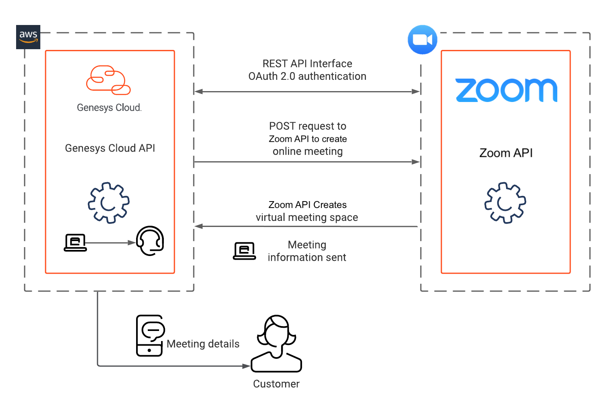
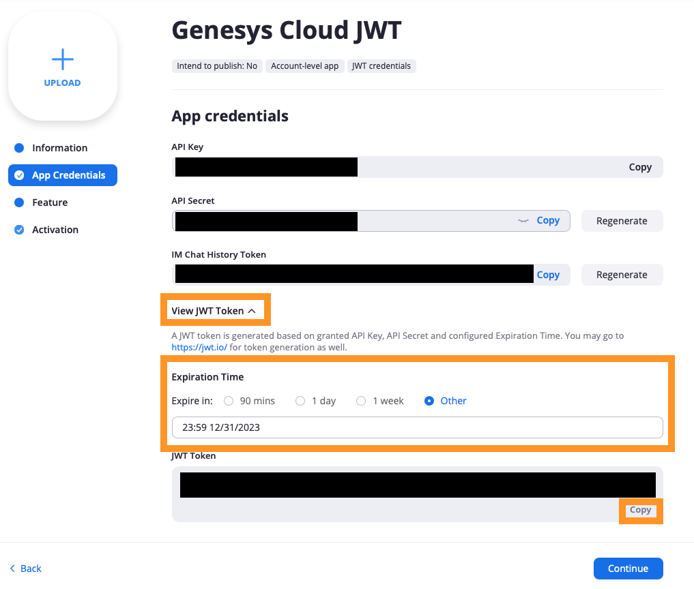
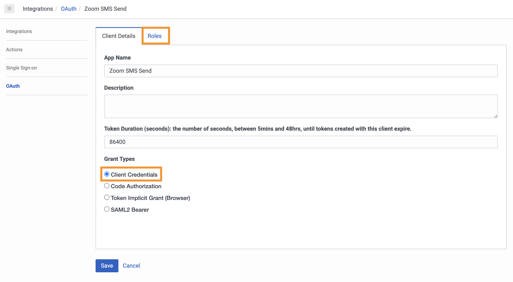
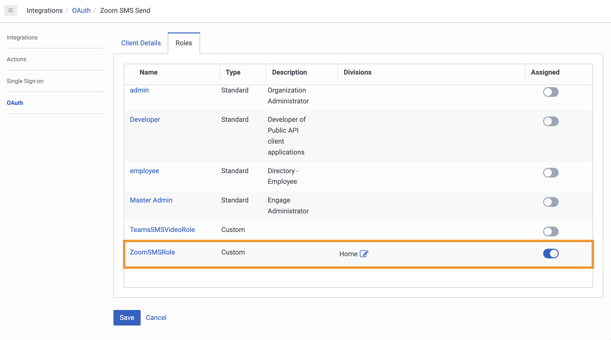
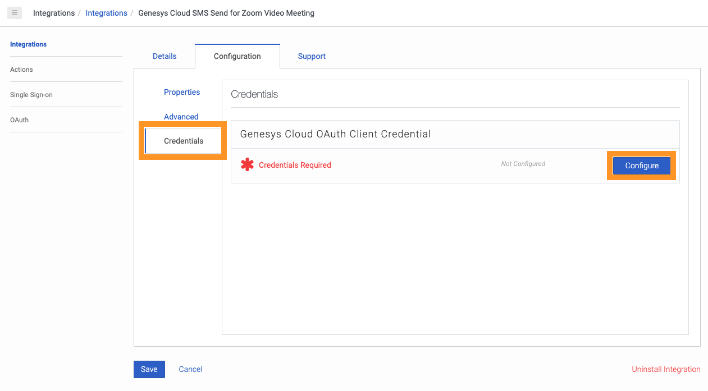
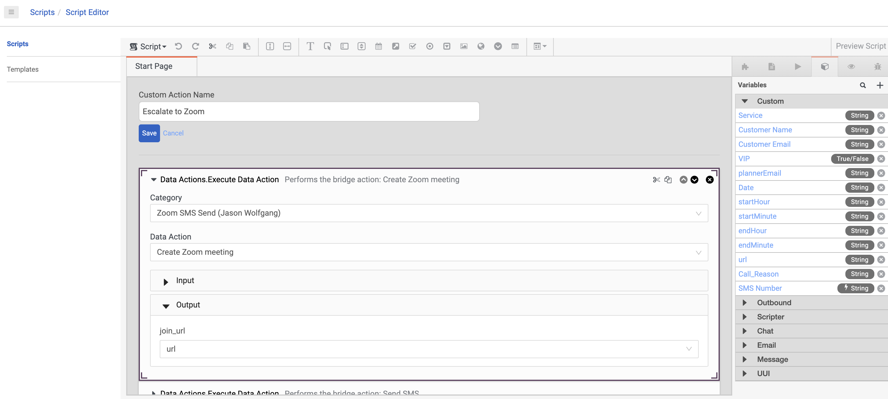
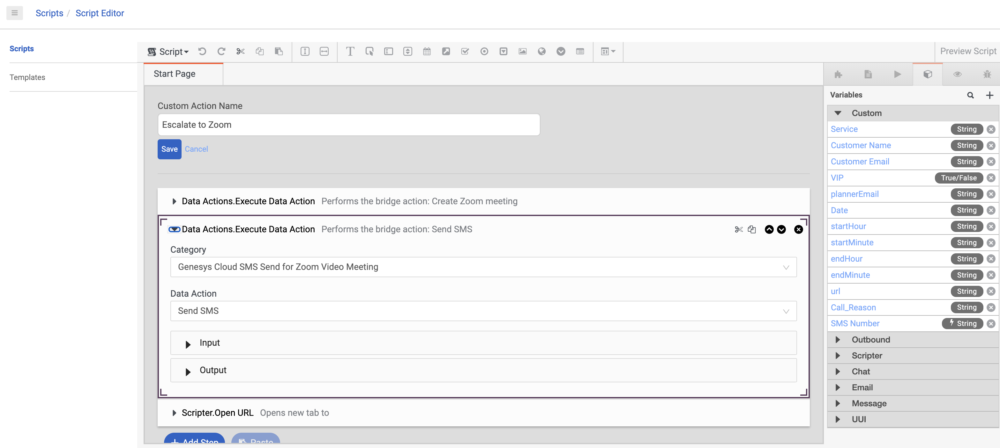
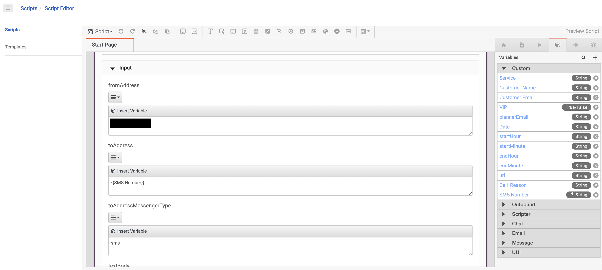

This Genesys Cloud Developer Blueprint explains how to set up Genesys Cloud and Zoom for agents to schedule a meeting with customers using Zoom. The agents can now directly schedule a Zoom meeting from Genesys Cloud. Genesys Cloud automatically sends an SMS message with the meeting URL to the customer and also opens the Zoom meeting for the agent. The call can be either inbound or outbound as long it is in a queue.

The following illustration shows the meeting scheduling solution from an agent’s point of view.

The following video shows the end-to-end customer and agent experience that this blueprint solution enables.

To enable an agent to create a Zoom meeting from their Genesys Cloud agent UI, you use several public APIs that are available from Genesys Cloud and Zoom. The following illustration shows the API calls between Genesys Cloud and Zoom.

## Solution components

* **Genesys Cloud CX** - A suite of Genesys cloud services for enterprise-grade communications, collaboration, and contact center management. Contact center agents use the Genesys Cloud user interface.
* **Genesys Cloud API** - A set of RESTful APIs that enables you to extend and customize your Genesys Cloud environment. The Genesys Cloud API for agentless SMS notification sends the meeting information to the caller.
* **Amazon Web Services (AWS)** - A cloud computing platform that provides a variety of cloud services such as computing power, database storage, and content delivery. AWS hosts Genesys Cloud.
* **Zoom** - A virtual meeting and collaboration app. Zoom is the app that hosts the meeting for our solution.

## Prerequisites

### Specialized knowledge

* Administrator-level knowledge of Genesys Cloud
* Administrator-level knowledge of Zoom
* Experience with REST API authentication
* Experience with Genesys Cloud scripting

### Genesys Cloud account

* A Genesys Cloud 3 license. For more information, see [Genesys Cloud Pricing](https://www.genesys.com/pricing "Opens the pricing article").
* The GMA/Portico Non-conversational, bi-directional SMS, MMS, Email and RCS messaging product must be activated in your Genesys Cloud organization.
* An SMS phone number purchased from your Genesys Cloud account. For information on how to purchase an SMS number, see [Purchase SMS long code numbers](https://help.mypurecloud.com/articles/purchase-sms-long-code-numbers/) in the Genesys Cloud Resource Center.
* The Master Admin role in Genesys Cloud. For more information, see [Roles and permissions overview](https://help.mypurecloud.com/?p=24360 "Opens the Roles and permissions overview article") in the Genesys Cloud Resource Center.

### Zoom account

* An Enterprise Zoom account is required.  
* Admininstrator-level role to set up the required authorization and permissions for Genesys Cloud in Zoom.
* Zoom license for each agent

## Implementation steps

### Configure the Zoom custom app

To enable Genesys Cloud to authorize and retrieve user information from the Zoom API, register your custom application in Zoom.

1. Log in to the [Zoom App Marketplace](https://marketplace.zoom.us/ "Goes to the Zoom App Marketplace").
2. Hover over **Develop** and click **Build App**.

   

3. In the **JWT** box, click **Create**

   

4. Give your app a name, define the app type, and turn off Zoom App Marketplace publishing. Then click **Create**

5. Expand the **View JWT Token** section. Set **Expire in:** to **Other** and define your desired expiration date.

6. Click **Copy** to copy the JWT token.

   

### Configure Genesys Cloud

### Add a web services data actions integration

To enable communication from Genesys Cloud to Zoom, add a web services data actions integration.

1. In Genesys Cloud, install a web services data actions integration. For more information, see [Add a data actions integration](https://help.mypurecloud.com/?p=177879 "Opens the Add a data actions integration article").

   

2. Rename the web services data actions integration and provide a meaningful description.

   

3. Navigate to **Configuration** > **Credentials** and click **Configure**.

   

4. Under **Credential Type**, click **User Defined**. Then click **Add Credential Field**. In the Field Name box, type token. In the **Value** box, paste the JWT token that you obtained when you [configured your Zoom custom app](#configure-the-zoom-custom-app "Goes to the Configure the Zoom custom app section" ). Then click **OK**.

   

5. Activate the integration and click **Save**.  

### Import the authentication data action

When you add a new web services data actions integration within an organization, Genesys Cloud creates a **Custom Auth** data action automatically. For this solution, you import this authentication data action into another data action.

 1. In the Genesys Cloud **Admin** menu, navigate to **Integrations** > **Actions** and open the **Custom Auth** data action.

 

 2. At the bottom of the Custom Auth data action page, click **Viewing** and change the status of the data action from **Published** to **Draft**.
 3. From the [zoom-meetings-sms-blueprint GitHub repository](https://github.com/GenesysCloudBlueprints/zoom-meetings-sms-blueprint "Opens zoom-meetings-sms-blueprint GitHub repository"), download the Zoom-SMS-Video-Send-Web-Services-Data-Action-Auth.customAuth.json file. Save this file to your local desktop.
 4. In Genesys Cloud, click **Import** and browse to select the downloaded file.
    

 5. Click **Import Action**.

    :::primary
    **Note:** In the Publish Action window, click **Yes** to publish the data action. The Import Action button modifies only the data action configuration and not the data action contract.
    :::

    

 6. Click **Save & Publish**.
 7. Return to the web services data action integration and verify that the data action has the **Active** status.

### Create a custom role for use with Genesys Cloud OAuth client

1. In the Genesys Cloud **Admin** menu, navigate to **People & Permissions** > **Roles/Permissions** and a role for this solution.
   

2. Type a meaningful name for your custom role. For example, ZoomSMSRole.

  

3. Search and select the Conversation>message>Create and messaging>sms>send permissions and then click **Save** to assign the appropriate permissions to your custom role.

:::primary
**Note:** Assign this custom role to your user record before you create the Genesys Cloud OAuth client. The messaging>sms>send permission requires the GMA/Portico Non-conversational, bi-directional SMS, MMS, Email and RCS messaging product to be activated in your Genesys Cloud organization.
:::

  

### Create an OAuth client for use with the Genesys Cloud data actions integration

To enable Genesys Cloud data action to make requests to an organization, you must use an OAuth client to configure authentication with Genesys Cloud.

1. Navigate to **Integrations** > **OAuth** and click **Add Client**.

   

2. Enter a name for the OAuth client and select **Client Credentials** as the Grant Type. Click the **Roles** tab and assign the roles for the OAuth client.

   :::primary
   **Note:** Select a custom role that includes the permission Messaging > Sms > Send. No default role includes this permission. To create a custom role, see the Custom roles information in [Roles and permissions overview](https://help.mypurecloud.com/?p=24360 "Opens the Roles and permissions overview article in the Genesys Cloud Resource Center").
   :::

   

3. Click **Save** and record the client ID and client secret values for later use.

   

### Add a Genesys Cloud data actions integration

The Zoom video session URL is sent as an SMS to the customer from Genesys Cloud. To enable this SMS capability, you must add a Genesys Cloud data actions integration.

1. In Genesys Cloud, install the **Genesys Cloud data actions integration**. For more information, see [About the data actions integrations](https://help.mypurecloud.com/?p=209478 "Opens the About the data actions integrations article in the Genesys Cloud Resource Center").

   

2. Enter a name for the Genesys Cloud data actions integration.

   

3. On the **Configuration** tab, select **Credentials** and click **Configure**.

   

4. Enter the OAuth client ID and client secret that you noted in the [OAuth client creation](#create-an-oauth-client-for-use-with-the-genesys-cloud-data-actions-integration "Goes to the Create an OAuth client for use with the Genesys Cloud data actions integration section"). Click **OK** and save the data actions integration.

   

5. Navigate to the main Integrations page and set the SMS data actions integration to **Active**.

   

### Load the supporting data actions

To enable the **Send SMS** button, which sends the Zoom video session URL to the customer, you must import two more data actions:
* [Create Zoom video meeting data action](#import-create-zoom-video-meeting-data-action "Goes to the Import Create Zoom video meeting data action section")
* [Send SMS data action](#send-sms-data-action "Goes to the Send SMS data action section")

### Import the Create Zoom Meeting data action

The Create Zoom Meeting data action uses the authenticated token that is supplied by other data actions to request a new Zoom video meeting URL.

1. Download the *Create-Zoom-Meeting.custom.json* file from the [zoom-meetings-sms-blueprint repo](https://github.com/GenesysCloudBlueprints/zoom-meetings-sms-blueprint "Opens the zoom-meetings-sms-blueprint repo") in GitHub. Save this file in your local desktop. Later you will import it into Genesys Cloud.

2. In the Genesys Cloud **Admin** menu, navigate to **Integrations** > **Actions** and click **Import**.

   

3. Select the *Create-Zoom-Meeting.custom.json* file and associate with the web services data action integration that you created in the [Add a web services data actions integration](#add-a-web-services-data-actions-integration "Goes to the Add a web services data actions integration section") section and click **Import Action**.

   

### Send SMS data action

This data action creates and sends an SMS message that contains the Zoom video meeting URL to the customer. The Create Zoom Video Meeting data action that you configured creates the URL.

1. Download the *Send-SMS.custom.json* file from the [zoom-meetings-sms-blueprint repo](https://github.com/GenesysCloudBlueprints/zoom-meetings-sms-blueprint "Opens the zoom-meetings-sms-blueprint repo") in GitHub. Save this file in your local desktop to import it into Genesys Cloud.
2. Navigate to **Integrations** > **Actions** and click **Import**.

   

3. Select the *Send-SMS.custom.json* file and associate it with the web services data action that you created in the [Add a web services data actions integration](#add-a-web-services-data-actions-integration "Goes to the Add a web services data actions integration section") section. Then click **Import Action**.

   

### Import and publish the script

You need to import the script *Send-SMS-with-Zoom-Video-URL.script* that references the created data actions. The script generates the **Escalate to Zoom** button for agents during an active interaction with the customer. It also sends an SMS that contains the Zoom video URL to the customer.

1. Download the *Send-SMS-with-Zoom-Video-URL.script* file from the [zoom-meetings-sms-blueprint](https://github.com/GenesysCloudBlueprints/zoom-meetings-sms-blueprint "Opens the zoom-meetings-sms-blueprint") GitHub repository. Save this file to your local desktop to import it into Genesys Cloud.

2. In the Genesys Cloud **Admin** menu, navigate to **Contact Center** > **Scripts** and click **Import**.

   

3. Click the downloaded *Send-SMS-with-Zoom-Video-URL.script* file.

   

4. Open the Script menu.

   

5. Click the **Actions** icon. Under **Custom**, click **Escalate to Zoom**.

  

6. Expand the first data action.

   

7. From the **Category** list, select the category for your "Create Zoom Meeting" data action.  From the **Data Action** drop menu, select
the data action that creates the Zoom meeting.

  

8. Expand the input variables for the first data action.

  

9. Type the desired value in the **user** input variable.

  :::primary
  **Note:** The variable value in the example below will create a Zoom meeting through the agent's Zoom account.  For this to work, the agent's Genesys Cloud email address must match their Zoom email address.  If you'd like to use the same Zoom account to create the Zoom meeting regardless of which agent is on the interaction, you can define a static value here.  It can be either the email address or object ID of a person in the Zoom Activity Directory where your app is registered.
  :::

10. Expand the output variables for the first data action.

  

11. Expand the second data action.

   

12. From the **Category** drop menu, select your Zoom Send SMS data action.  From the **Data Action** drop menu, select your "Send SMS" data action.

 

13. Expand the input variables for the second data action.

14. In the **fromAddress** input variable field, type one of the SMS numbers that you purchased from your Genesys Cloud organization. Use the format,  +11234567890.

 

15. Confirm the remaining input variables of the second data action match the example below.

 

16. Below the Custom Action Name, click **Save**.

  

17. From the **Script** menu, click **Save**.

   

18. From the **Script** menu, click **Publish**.

   

19. In the Genesys Cloud **Admin** menu, navigate to **Contact Center** > **Queues** and select the queue you'd like to associate with this script.

20. Click the **Voice** tab. From the **Default Script** list, select the "Send-SMS-with-Zoom-Video-URL" script.

    

## Test the deployment

Test the Create Zoom video meeting URL data action from within the data action.

1. In the Genesys Cloud **Admin** menu, navigate to **Integrations** > **Actions** and select the Create Zoom Video Meeting data action.

2. Navigate to **Setup** > **Test**, enter your user, startTime, endTime and timeZone, and then click **Run Action**.

    :::primary
    **Note:** The startTime and endTime parameters must be in ISO-8601 format. The user parameter can be the Zoom user's ActiveDirect Object ID or the Zoom user's email address.
    :::

   

Test the Send SMS data action from within the data action.

1. In the Genesys Cloud **Admin** menu, navigate to **Integrations** > **Actions**, and select the Send SMS data action.

2. Navigate to **Setup** > **Test**, enter your user, startTime, endTime and timeZone, and then click **Run Action**.

   :::primary
   **Note:** The fromAddress parameter must be one of the purchased SMS Numbers within your Genesys Cloud organization. See additional resource below for detailed steps for purchasing an SMS number.  The toAddressMessengerType must be "sms".
   :::

  

## Additional resources

- [Create a Zoom Meeting](https://marketplace.zoom.us/docs/api-reference/zoom-api/methods#operation/meetingCreate "Opens the Zoom documentation") in the Zoom API Reference
- [Purchase SMS long code numbers](https://help.mypurecloud.com/articles/purchase-sms-long-code-numbers/) in Genesys Cloud Help
- [About Scripting](https://help.mypurecloud.com/?p=54284 "Opens the About scripting article in the Genesys Cloud Resource Center")
- [Agentless SMS Notifications](https://developer.mypurecloud.com/api/tutorials/agentless-sms-notifications/index.html?language=java&step=1 "Opens the SMS tutorial") in the Genesys Cloud Developer Center
- [Auto Send SMS](https://developer.mypurecloud.com/api/tutorials/sms-sending/index.html?language=nodejs&step=1 "Opens the SMS Sending tutorial") in the Genesys Cloud Developer Center
* [About the web services data actions integration](https://help.mypurecloud.com/?p=127163 "Goes to the About the web services data actions integration article") in the Genesys Cloud Resource Center
